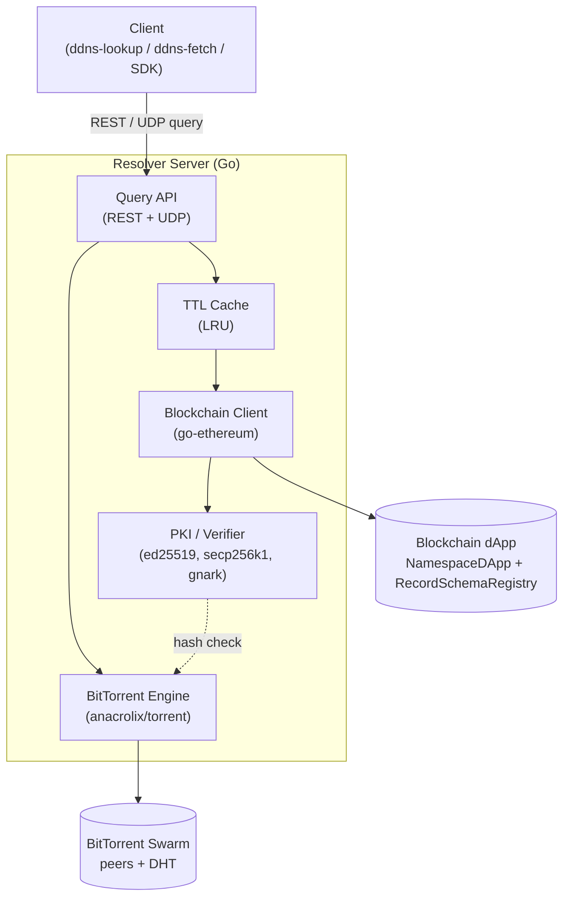

# Decentralized DNS

> A blockchain-native DNS **and** Public Key Infrastructure — no ICANN, no registrars,
> no certificate authorities. Namespaces live on-chain, large static content lives on
> BitTorrent, and every answer is cryptographically verifiable end-to-end.

[](https://github.com/devCana/decentralized-dns/actions/workflows/ci.yml)
[](./LICENSE)
[](https://go.dev/)
[](https://soliditylang.org/)

Decentralized DNS replaces the centrally-administered DNS + X.509 stack with three
cooperating decentralized tiers — a **Solidity dApp** for the namespace registry and typed
record store, a **Go resolver** that caches and cryptographically verifies every answer,
and the **BitTorrent swarm** for bulk content. The only trusted authorities are blockchain
consensus and each domain owner's private key: a resolver can never forge or tamper with
an answer without the client detecting it.

Built end-to-end — smart contracts, a production-style Go server, a hand-rolled binary
wire protocol, zero-knowledge proofs, a P2P content layer, and three CLIs — with tests, CI,
and a one-command demo.

---

## Highlights

- **Zero-knowledge proofs.** A [gnark](https://github.com/consensys/gnark) Groth16 circuit
  proves each served record matches its on-chain MiMC commitment — verified both
  client-side and on-chain (`ZKVerifier.sol`).
- **Native PKI, no certificate authorities.** Domain owners sign records with secp256k1
  (EIP-191); the resolver signs every response with an ed25519 identity. Clients
  **re-verify both** and never trust the resolver.
- **Content-addressed P2P storage.** Large files live on BitTorrent; the resolver re-hashes
  every payload (SHA-256) against the chain before serving, so a tampered file can never
  reach a client.
- **Two front ends.** A JSON REST API *and* a hand-rolled compact **binary UDP protocol**
  (custom TLV framing) for low-latency lookups.
- **Real systems engineering.** TTL + LRU caching with event-driven invalidation, RPC
  retry/back-off, per-IP rate limiting, graceful shutdown, and a concurrency-tested cache.
- **Tested & reproducible.** 55 contract tests plus Go unit/concurrency tests (run under
  `-race`), CI on every push, and `make demo` for a full local end-to-end run.

## Architecture



A standard lookup hits the in-memory TTL cache. On a miss the resolver reads the record
plus the domain identity from the chain in a single call, verifies the owner's EIP-191
signature, optionally produces a Groth16 proof that the served payload matches the
on-chain commitment, signs the whole response with its own ed25519 identity key, and
caches it for the record's TTL. For a `ResourceRef`, it additionally fetches the file
over BitTorrent and re-computes SHA-256 before a single byte reaches the client.

See [`docs/high-level-design.md`](./docs/high-level-design.md) for the full design,
including sequence diagrams for registration, cache hit/miss, and resource fetch.

## Features

| Feature | Status | Notes |
|---|---|---|
| Decentralized namespace registration / renewal / transfer | ✅ | Length-based pricing, 1-year periods, on-chain fee collection |
| Typed record store with schema validation | ✅ | Mandatory/optional fields enforced on-chain (`RecordSchemaRegistry`) |
| Dynamic record-type expansion | ✅ | New record types declared permissionlessly (UC-9) |
| Extended query selectors (port / transport / service) | ✅ | `?selector=service=HTTP&transport=TCP&port=443` |
| TTL caching resolver with event-driven invalidation | ✅ | LRU + per-record TTL; chain events evict stale entries |
| Owner-signature (PKI) verification | ✅ | secp256k1 EIP-191 signatures recovered to the on-chain pubkey |
| Resolver-identity response signatures | ✅ | Every REST/UDP answer sealed in an ed25519 envelope |
| Zero-knowledge record-commitment proofs | ✅ | gnark MiMC circuit, Groth16, on-chain `ZKVerifier` |
| BitTorrent `ResourceRef` storage with hash verification | ✅ | Tampered files are discarded, never served |
| Resource type validation (secondary) | ✅ | Local content sniffing; advisory by default, strict via `ENFORCE_CONTENT_TYPE`; re-checked trustlessly in `ddns-fetch` |
| REST query API | ✅ | `/resolve`, `/resource`, `/web/{name}`, `/domains/{name}`, `/types`, `/healthz` |
| UDP query API (secondary) | ✅ | Compact binary TLV wire format |
| Operator console | ✅ | `/admin` dashboard + `/admin/stats` JSON (cache, chain head, swarm health, identity) |
| Browser gateway | ✅ | `/web/{name}` renders a verified decentralized site in any browser |
| On-chain resolver discovery | ✅ | `ResolverRegistry` + `ddns-lookup --discover` (bootstrap with no legacy DNS) |
| Owner CLI + lookup/fetch client tools | ✅ | `ddns`, `ddns-lookup`, `ddns-fetch` |
| Containerized deployment | ✅ | Static `CGO_ENABLED=0` image; `docker compose up` for the full stack |
| Resolver incentives (pay-per-query) | ✅ | `ResolverIncentives` micropayment channels — exploit-resistant by construction ([model](./docs/incentives.md)) |
| Browser integration | ✅ | `/web` gateway + a Manifest V3 extension (omnibox `ddns <name>` + in-browser envelope verification) |

## Repository layout

```
decentralized-dns/
├── contracts/                 # Hardhat workspace — the on-chain dApp
│   ├── contracts/
│   │   ├── NamespaceDApp.sol          # registry, records, fees, transfer
│   │   ├── RecordSchemaRegistry.sol   # dynamic record-type schemas
│   │   ├── ResolverRegistry.sol       # on-chain resolver discovery directory
│   │   ├── ResolverIncentives.sol     # pay-per-query micropayment channels
│   │   └── ZKVerifier.sol             # gnark-exported Groth16 verifier
│   ├── scripts/               # deploy, seed, record-signing helper
│   └── test/                  # Hardhat test suite
├── resolver/                  # Go resolver server + CLIs
│   ├── Dockerfile             # static CGO_ENABLED=0 image (distroless)
│   ├── cmd/
│   │   ├── resolver/          # the resolver daemon
│   │   ├── ddns/              # domain-owner CLI (register/set/transfer/…)
│   │   ├── ddns-lookup/       # query a resolver + verify the response
│   │   ├── ddns-fetch/        # resolve a ResourceRef to disk
│   │   ├── record-commit/     # dev tool: compute a record's ZK commitment
│   │   └── zkgen/             # dev tool: Groth16 trusted-setup ceremony
│   └── internal/
│       ├── server/            # REST + UDP front ends, rate limiting
│       ├── chain/             # go-ethereum client + generated bindings
│       ├── cache/             # TTL LRU cache
│       ├── pki/               # ed25519 identity + secp256k1 owner sigs
│       ├── zk/                # gnark circuit, prove/verify
│       ├── torrent/           # anacrolix/torrent engine + SHA verification
│       ├── query/             # query parsing/normalization
│       └── config/            # environment configuration
├── extension/                 # Manifest V3 browser extension (omnibox + verify)
├── docs/                      # design documentation (Markdown)
├── scripts/demo.sh            # one-command end-to-end demo
├── docker-compose.yml         # full stack: chain + deploy/seed + resolver
└── Makefile                   # build / test / deploy / demo targets
```

## Quick start

### Prerequisites

- **Go** 1.25+
- **Node.js** 22+ (for the Hardhat contract workspace)
- **make**

### One-command demo / live presentation

```bash
make start
```

This boots a local Hardhat node, deploys and seeds the contracts, starts the Go
resolver daemon, and seeds a decentralized website over BitTorrent. Query it at
`http://localhost:8080/web/example` or access the admin console at
`http://localhost:8080/admin`.

For the automated end-to-end test script, run:
```bash
make demo
```

### Docker (full stack)

```bash
docker compose up --build
```

Brings up the chain, deploys + seeds the contracts, and starts the resolver wired to
them (addresses auto-detected from a shared volume). Query it at `http://localhost:8080`
once healthy. The resolver image is a single static `CGO_ENABLED=0` binary on
`distroless` — the ZK proving artifacts are embedded, so nothing else ships with it.

### Manual setup

```bash
# 1. Contracts: install, compile, start a local chain, deploy + seed
make contracts-install
make chain                 # in a separate terminal — runs `hardhat node`
make deploy-localhost      # writes contracts/deployments/localhost.json
make seed-localhost        # registers a demo domain + records

# 2. Resolver: run it — contract addresses are auto-detected from the deploy
#    artifact (contracts/deployments/localhost.json), so no config is needed.
cd resolver
go run ./cmd/resolver
#    To override ports, rate limits, etc., `cp .env.example .env` and edit it;
#    a local .env is loaded automatically.

# 3. Query it
curl 'http://localhost:8080/resolve?name=example&type=A'
```

### Deploy to a public testnet (Sepolia)

Save your `SEPOLIA_PRIVATE_KEY` and `SEPOLIA_RPC_URL` in `contracts/.env`, then run:

```bash
make deploy-sepolia        # writes contracts/deployments/sepolia.json
```

Or deploy manually:
```bash
cd contracts
export SEPOLIA_RPC_URL=https://… SEPOLIA_PRIVATE_KEY=0x…   # funded from a Sepolia faucet
npx hardhat run scripts/deploy.ts --network sepolia        # writes deployments/sepolia.json
```

Point the resolver at it with `RPC_URL=$SEPOLIA_RPC_URL` and
`DEPLOYMENTS=contracts/deployments/sepolia.json` (or `./ddns resolver --sepolia`).
Unlike the gitignored localhost artifact, a public-testnet `deployments/sepolia.json` is
safe to commit.

## Resolver REST API

All successful responses are wrapped in a resolver-signed ed25519 envelope so clients can
authenticate the resolver. Binary fields are `0x`-hex so signatures and commitments can be
re-verified byte-exactly.

| Method & path | Purpose |
|---|---|
| `GET /healthz` | Liveness + current chain head (exempt from rate limiting) |
| `GET /resolve?name=&type=&selector=&port=&transport=&service=` | Resolve a single record (UC-4/UC-5) |
| `GET /resource?name=&selector=&peer=` | Resolve a `ResourceRef` and stream the verified file bytes (UC-6) |
| `GET /web/{name}?selector=` | Render a verified decentralized site in any browser (defaults to `service=HTTP`) |
| `GET /domains/{name}` | Raw domain state + all live records |
| `GET /types` | All declared record types |
| `GET /admin`, `GET /admin/stats` | Operator console (HTML dashboard + JSON): cache, chain head, swarm health, identity |

**Example**

Successful responses are wrapped in a signed envelope `{ data, resolver, signature }`;
`.data` is the resolve result:

```console
$ curl -s 'http://localhost:8080/resolve?name=example&type=A' | jq .data
{
  "query":  { "name": "example", "type": "A", "selector": "" },
  "found":  true,
  "record": { "type": "A", "fieldNames": ["address"], "fieldValues": ["93.184.216.34"], "ttl": 3600, ... },
  "owner":  "0x…",
  "pubKey": "0x04…",
  "ownerSigVerified": true,
  "cached": false
}
```

A missing record is a typed, authoritative "no match" (`found:false`, `error:no_match`)
returned with HTTP 200 — the decentralized equivalent of `NXDOMAIN`.

## UDP query protocol

As a secondary, low-latency front end the resolver also speaks a compact binary protocol
on `UDP_PORT` (default `5353`). Packets use a 6-byte header (`"DDNS"` magic, 1-byte
version, 1-byte flags/status) followed by length-prefixed TLV fields for the name, type,
and selector. The response carries the same resolver-signed JSON envelope as the REST API
inside a TLV. See [`resolver/internal/server/udp.go`](./resolver/internal/server/udp.go).

## Command-line tools

### `ddns` — domain-owner CLI

Available as a root script (`./ddns`) or compiled binary (`resolver/bin/ddns`). Signs
every transaction locally with the owner's key (`--key` or `DDNS_PRIVATE_KEY`); the
private key never leaves the machine and is never sent to a resolver. Automatically
loads `contracts/.env` and selects the active network. Contract addresses are read from
`--deployments` (default `contracts/deployments/localhost.json`).

```bash
ddns register example                                    # commit, wait ~30s, then reveal (pays the on-chain fee)
ddns set example A address=93.184.216.34                 # sign + store an A record (ttl 3600 default)
ddns set example SVC --selector "service=SMTP&transport=TCP&port=25" \
    target=mail.example service=SMTP transport=TCP port=25
ddns publish-resource example ./site.html --selector service=HTTP   # seed + anchor a ResourceRef
ddns transfer example 0xNEWOWNER --pubkey 0x04...        # hand over ownership (new owner's pubkey)
ddns renew example                                       # extend the registration
ddns declare-type GEO --mandatory lat,lon                # declare a new record type
ddns withdraw                                            # treasurer: sweep collected fees
ddns announce-resolver --endpoint http://my-resolver:8080  # publish a resolver to the on-chain directory
ddns resolvers                                           # list resolvers others can discover

# Pay-per-query micropayment channels (docs/incentives.md):
ddns channel-open --resolver-operator 0xRESOLVER --amount 0.1   # fund a resolver
ddns voucher --channel 0xID --amount 0.03                       # sign a per-query voucher (client)
ddns channel-claim --channel 0xID --amount 0.03 --voucher 0x…   # redeem it (resolver operator)
```

Flags may appear before or after positional arguments.

### `ddns-lookup` — verifying client

Independently re-checks the cryptography (it does not just trust the resolver's flags):
the resolver's ed25519 envelope, the owner's secp256k1 record signature recovered against
the on-chain pubkey, and the Groth16 commitment proof.

```bash
ddns-lookup example A
ddns-lookup example SVC --selector "service=SMTP&transport=TCP&port=25"
ddns-lookup --discover example A   # bootstrap: find + pin a resolver on-chain, then cross-check its answer against NamespaceDApp.resolve
```

```text
resolver:  0x055b…470f (envelope signature OK)
owner:     0x7099…79C8
record:    A address=93.184.216.34 (ttl=3600s)
owner sig: OK (recovered to on-chain pubKey + owner address)
zk proof:  OK (Groth16 commitment proof verifies)
```

### `ddns-fetch` — resource downloader

Resolves a `ResourceRef`, downloads the BitTorrent-hosted file through the resolver, and
verifies the body's SHA-256 against the on-chain hash and the resolver's provenance
signature before writing it out.

```bash
ddns-fetch example --selector service=HTTP -o site.html   # fetch + verify to disk
```

## Smart contracts

- **`NamespaceDApp`** — the on-chain authority. Domains keyed by `keccak256(name)` store
  owner address, public key, expiry, and a *generation* counter that logically
  invalidates records left behind by a previous owner. Enforces length-based pricing,
  single-owner access control, schema-validated record writes, and CEI-pattern fee
  refunds. Emits `Registered` / `Renewed` / `Transferred` / `RecordSet` / `RecordRemoved`
  for resolver cache invalidation.
- **`RecordSchemaRegistry`** — declares record types and their mandatory/optional fields,
  consulted on every record write so dynamic types validate without protocol changes.
- **`ZKVerifier`** — gnark-exported Groth16 verifier for the record-commitment circuit.

## Security & trust model

- **End-to-end integrity.** Records are signed by the domain owner's secp256k1 key
  (EIP-191); the resolver and clients recover the signer and check it against the
  on-chain public key and owner address. A resolver cannot alter a record undetected.
- **Resolver authentication.** Every response is sealed in an ed25519 envelope keyed to
  the resolver's published identity, so clients can pin and verify which resolver
  answered.
- **Content integrity.** `ResourceRef` files are re-hashed (SHA-256) against the on-chain
  hash before being served; a tampered or forged file is discarded and the resolver
  retries another peer (UC-10).
- **Zero-knowledge commitments.** A Groth16 proof attests that the served payload matches
  the record's on-chain MiMC commitment, verifiable on-chain via `ZKVerifier`.
- **Sybil resistance.** Because clients verify on-chain signatures and never trust a
  single resolver, running many fake resolvers gains an attacker nothing.
- **Registration front-running resistance.** `ddns register` uses commit-reveal
  (mirroring ENS): it commits to a salted hash of the name, waits out
  `MIN_COMMITMENT_AGE`, then reveals via `register()`. Nobody who observes the reveal
  transaction in the mempool can front-run it — they'd need the secret salt, which
  only the committer holds.
- **Per-site browser isolation.** `/web/<name>` and `/resource` responses carry a
  `Content-Security-Policy: sandbox` header (no `allow-same-origin`), so every
  decentralized site gets its own opaque browser origin instead of sharing the
  resolver's — otherwise one malicious name could read another's cookies, storage, or
  hijack its service-worker scope, since they'd all sit under the same real origin.

## Development

```bash
make build            # compile contracts + resolver
make test             # hardhat tests (55) + go vet + go test
make start            # launch 1-click live demo stack (chain + resolver + web)
make deploy-sepolia   # deploy contracts to public Sepolia testnet
make race             # Go suite under the race detector (CI runs this)
make cover            # resolver coverage report
make fmt              # gofmt -w (CI fails on unformatted code)
make contracts-test   # Hardhat suite only
make resolver-test    # go vet ./... && go test ./...
make bindings         # regenerate Go contract bindings (abigen)
make zk-setup         # regenerate the Groth16 artifacts + verifier (dev only)
make clean
```

CI (`.github/workflows/ci.yml`) compiles both sides, enforces `gofmt`, and runs the
contract suite plus the Go suite under `-race` with a coverage summary on every push and
pull request. The cryptographic core is held to negative-path coverage: signing and
envelope formats ship with tamper tests proving a mutated field invalidates the signature.
See [CONTRIBUTING.md](./CONTRIBUTING.md) for the local dev loop.

## Documentation

- [High-Level Design](./docs/high-level-design.md) — architecture, flows, class diagram,
  use cases, references.
- [Functional Specification](./docs/functional-spec.md) — features, scope, assumptions.

## Project status

A complete, working decentralized DNS + PKI, built as a university project. Both the
contracts and the resolver are feature-complete for the implemented scope (every main and
secondary feature above), with passing test suites on both sides and a verified end-to-end
`make demo`. The two originally-deferred nice-to-haves have since landed too: resolver
incentives as pay-per-query micropayment channels (`ResolverIncentives.sol` +
[docs/incentives.md](./docs/incentives.md)), and browser integration as the `/web`
gateway plus a Manifest V3 [extension](./extension/).

## Authors & license

Built by **Mohammed Awawdi**, **Ibrahim Kamel**, and **Ahmad Ghanayim**.

Released under the [MIT License](./LICENSE).
